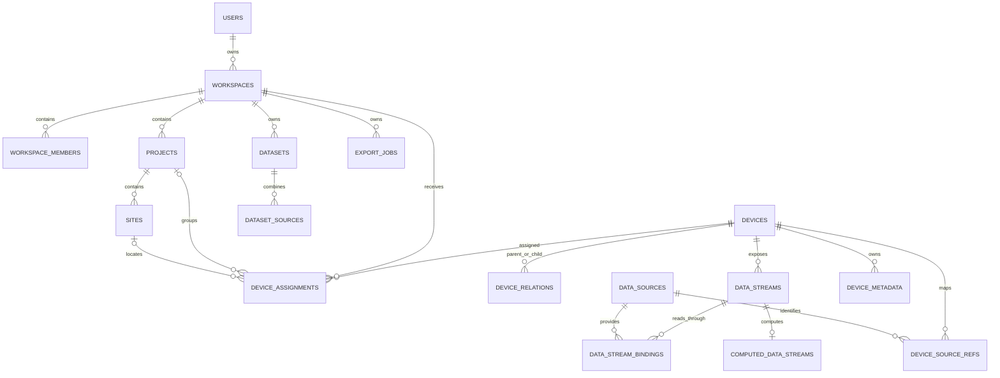

# THCPN Platform Database Design

本文档描述业务平台 PostgreSQL 单一基线迁移 `000001_init` 的最终结构。业务 schema 包含
49 张表；执行迁移后，`golang-migrate` 还会创建自己的 `schema_migrations` 工具表。

## 1. 数据边界

平台数据库只保存平台拥有的业务数据、权限关系、源库映射和必要的配置快照。

| 数据类别 | 保存位置 | 说明 |
| --- | --- | --- |
| 用户、工作区、项目、站点 | 平台 PostgreSQL | 平台业务主数据 |
| 设备身份、类型、生命周期 | 平台 PostgreSQL | 用于授权、分配、拓扑和业务管理 |
| 设备名称、描述、业务分类、用户元数据 | 平台 PostgreSQL | 平台可编辑的数据 |
| 数据源和外部设备映射 | 平台 PostgreSQL | 只保存源 ID 和外部设备 ID |
| 经纬度、海拔、电压、信号、在线状态等运行数据 | THCPN 源库 | API 查询时实时读取，不在平台重复保存 |
| 原始遥测和图片 | THCPN 源库或对象存储 | 平台只保存数据流定义和读取绑定 |
| 计算指标结果 | 不持久化 | 查询时根据公式、原始遥测和设备元数据计算 |
| 设备配置 | THCPN 源库为当前值；平台保存快照 | 快照用于管理、同步与配置版本检查 |

## 2. 核心关系

## 3. 账号与认证

### `users`

平台普通用户主表。保存姓名、手机、邮箱、账号状态、验证时间、最后登录时间和
`auth_version`。不保存密码正文。

### `user_credentials`

用户密码凭据，一名用户一条记录。保存密码哈希、失败次数、锁定时间、密码更新时间和
强制改密状态。删除用户时级联删除。

### `user_mfa_totp`

用户 TOTP 多因素认证配置。密钥以密文和 nonce 保存，并记录启用时间和最近使用的时间步。

### `auth_refresh_sessions`

普通用户刷新令牌会话。保存令牌哈希、客户端信息、有效期、最后使用和撤销时间，用于多端
登录及单会话注销。

### `auth_access_token_blacklist`

已主动撤销但尚未自然过期的访问令牌哈希。用于立即阻止旧 access token。

### `auth_password_change_sessions`

找回或修改密码的一次性会话。保存令牌哈希、有效期和使用时间。

### `system_admins`

系统管理员独立账号，不属于普通用户或工作区。保存姓名、邮箱、密码哈希、登录锁定状态和
最后登录时间。

### `system_admin_refresh_sessions`

系统管理员刷新令牌会话，与普通用户会话完全隔离。

## 4. 工作区与权限

### `workspaces`

平台租户边界。保存工作区类型、组织类型、名称、所有者和状态。个人工作区按所有者唯一。
创建者拥有工作区；自己创建的工作区不能“离开”，只能删除。

### `workspace_members`

工作区成员关系。关联用户、角色、权限模板和作用域，可表达工作区、项目或其他资源级成员
关系。

### `roles`

角色定义。`workspace_id` 为空时是系统角色，否则是工作区自定义角色。

### `permissions`

稳定的权限字典，例如 `device.view`、`device.configure`。保存权限 code、资源类型和动作。

### `role_permissions`

角色和权限的多对多关系。

### `workspace_member_permissions`

成员最终拥有的显式权限集合。用于避免仅依赖角色名称推断权限。

### `access_grants`

资源授权记录。描述某个用户在工作区中的资源作用域、角色模板、过期时间、是否可转授权和
API 访问能力。`parent_grant_id` 记录授权委派链。

### `access_grant_permissions`

单条资源授权对应的显式权限集合。

### `invitations`

待接受的工作区或资源邀请。支持邮箱/手机号邀请、作用域、角色模板、过期时间和上级授权。

### `invitation_permissions`

邀请接受后应获得的显式权限集合。

## 5. 项目与站点

### `projects`

工作区下的项目。保存名称、描述、状态和创建者。项目名称在同一工作区的有效记录中唯一。

### `sites`

项目下的业务站点。保存名称、描述、文字位置以及站点级经纬度。

这里的经纬度是用户维护的业务站点位置，可作为设备地图的回退位置；它不是 THCPN 设备
实时上报位置。

## 6. 设备主数据与归属

### `devices`

平台设备主表，只保存稳定身份和业务状态：

- `serial_no`：平台唯一序列号。
- `name`、`product_id`、`device_type`：业务展示和设备类别。
- `status`：平台启用状态。
- `lifecycle_status`：入库、待认领、服役、退役等生命周期。
- `activated_at`、`lifecycle_updated_at`：关键业务时间。

不保存经纬高、电压、信号、源库属性、源设备 UUID 或源设备类型等实时或源库拥有的信息。

### `device_assignments`

物理设备当前或历史的工作区分配记录，可选关联项目和站点。同一设备只能有一条 active
分配。网关分配给工作区后，其节点权限通过拓扑继承，不为节点复制分配记录。

### `device_relations`

设备拓扑关系，当前主要表达网关和节点。保存平台父子设备、来源数据源、外部父子 ID、
关系类型、状态和同步时间。管理员调整拓扑后，节点继承新的网关权限。

### `device_profiles`

平台维护的设备业务资料，目前保存描述和文字地址。经纬度已从该表移除，实时位置从源库
读取。

### `device_profile_images`

设备资料图片。保存对象存储 key、原文件名、尺寸、说明、顺序和封面状态，不保存图片二进制。

### `device_capability_definitions`

平台支持的设备能力字典，例如遥测、图片、视频或控制能力。

### `device_capabilities`

设备和能力字典的多对多关系。

### `device_lifecycle_events`

设备生命周期变更日志。保存前后状态、发生时间、说明和操作用户。

### `device_operations`

用户发起的设备操作任务，例如配置或控制请求。保存请求 JSON、状态和发起者，不作为实时
设备状态表。

## 7. 数据源与源库映射

### `data_sources`

管理员维护的数据源实例。保存名称、类型、DSN 密钥引用、状态和创建者。数据库连接串本身
不写入该表，而是通过 `dsn_secret_ref` 从环境或密钥系统读取。`created_by` 关联独立的
`system_admins`，普通工作区用户不能创建或管理数据源。

### `device_source_refs`

平台设备到外部设备的稳定映射。只保存：

- 平台 `device_id`
- `data_source_id`
- 适配器 code
- 外部设备数值 ID
- 映射状态和同步时间

源设备 SN、UUID、设备类型、经纬度和运行属性均不在这里缓存。

### `data_streams`

设备的数据通道目录。保存设备、稳定 code、显示名称、类型、单位和状态。

该表既包含源库同步产生的原始遥测/图片通道，也包含用户定义的计算通道；是否为计算通道
通过 `computed_data_streams` 是否存在对应记录判断。

### `data_stream_bindings`

原始数据流的读取规则。关联数据流和数据源，保存适配器、表/字段映射、payload 类型及
`adapter_config_json`。计算数据流没有源绑定。

### `device_config_snapshots`

从 THCPN `device_config` 同步的设备配置快照。保存外部配置 ID、版本以及 data/image/control
三部分 JSON。管理员保存新配置时创建新源配置并同步快照，用于版本冲突检查和平台通道应用。

## 8. 设备元数据与计算指标

### `device_metadata`

用户为物理设备维护的业务元数据。每项包含稳定 key、显示名称、类型、JSON 值和可选单位。
支持 `number`、`string`、`boolean` 三种类型。

元数据跟随物理设备，不跟随用户或工作区。修改只保留当前值，并通过 `audit_logs` 记录操作，
不建立元数据历史表。

### `computed_data_streams`

查询时计算的数据流定义，与 `data_streams` 一对一，只保存公式和修改人。设备归属和启用
状态来自 `data_streams`，引用的原始 stream code 和数字元数据 key 在读取公式时解析。

计算结果不入库。遥测查询先读取同设备原始数据，按严格相同时间戳匹配后执行公式，再进行
抽样。元数据变化会影响所有历史时间范围的重新计算结果。

## 9. 设备环境分类

### `device_taxonomy_terms`

设备环境和用途分类字典。支持生态系统、观测对象、用途、管理方式和部署方式等 kind，具有
中英文名称、父级、状态和排序。

例如草原、农作物、沙尘监测、树木胸径、植物物候和草原修复都通过该字典表达，而不是不断
给 `devices` 增加固定列。

### `site_environment_profiles`

站点级单值分类和业务属性，包括生态系统、管理方式、部署方式、站点海拔、投运年份和科研
标签。设备可继承站点分类。

### `site_environment_terms`

站点与多值分类词条的关系，例如多个观测对象或用途。

### `device_environment_profiles`

设备级分类覆盖。保存设备直接设置的单值分类、投运年份、科研标签和覆盖字段列表。
设备海拔不保存于此，使用源库实时值。

### `device_environment_terms`

设备与多值分类词条的关系。

## 10. 数据集与导出

### `datasets`

工作区内保存的数据分析定义。记录项目、名称、说明、数据类型、时间范围、状态和创建者。
它是可复用查询配置，不复制原始遥测数据。

### `dataset_sources`

数据集包含的数据来源。通过 `source_type + source_id` 引用设备、数据流或文件。计算数据流
与普通数据流一样可以作为数据集来源。

### `export_jobs`

异步导出任务。保存资源、格式、请求配置、执行状态、结果对象 key、错误、生命周期时间和
下载过期时间。导出文件位于对象存储。

## 11. 公开访问与设备认领

### `device_publications`

设备公开页面配置。一台设备拥有永久随机 slug；关闭再开启、修改密码都不改变地址。
保存启用状态、密码哈希和 `access_version`。版本递增会让旧公开会话失效。

### `device_claim_credentials`

永久设备铭牌和手工认领码凭据。只保存哈希用于匹配，并保存密文用于管理员再次打印；
不把明文 token 暴露到普通查询中。

### `device_claim_requests`

成功认领的幂等记录。关联扫码用户、设备、目标工作区和最终分配记录，避免重复请求产生
多次分配。

### `camera_bindings`

相机设备与第三方视频服务的绑定。保存供应商、设备序列号、通道、默认清晰度、加密状态和
验证码密钥引用。供应商 app secret 不存于该表。

## 12. 审计与平台治理

### `audit_logs`

统一不可变操作日志。记录普通用户或系统管理员、动作、资源、结果、原因、IP、User-Agent
和 request ID。可关联工作区，但全局管理员操作允许工作区为空。

敏感密码、令牌和完整协议配置正文不应写入审计详情。

### `schema_migrations`

`golang-migrate` 自动维护的当前迁移版本和 dirty 状态。业务代码不直接读写。

## 13. 删除与生命周期原则

- 删除设备会级联删除其数据流、源映射、拓扑、资料、元数据、计算公式、公开配置和认领凭据。
- 删除工作区会级联删除成员、项目、站点、授权、数据集和导出任务。
- 原始 THCPN 数据不会因为删除平台设备而被删除。
- 数据流通常通过 `status` 禁用而不是立即删除，以保留业务引用稳定性。
- 审计日志引用用户、管理员或工作区时使用 `SET NULL`，尽量保留历史事实。
- 设备运行属性和位置由源库负责生命周期，平台查询失败时不使用陈旧缓存冒充实时值。

## 14. 维护入口

- 数据库基线：`migrations/000001_init.up.sql`
- 基线回滚：`migrations/000001_init.down.sql`
- SQLC 查询：`sql/queries/*.sql`
- 生成的数据访问代码：`internal/db/sqlc/`
- OpenAPI：`docs/openapi.yaml`
- 空库初始化：`make migrate-up`
- 重新生成 SQLC：`make sqlc`

## 15. 开发初始化账号

执行基线迁移会创建一套仅用于本地开发的登录凭据：

- 邮箱：`demo@thcpn.local`
- 密码：`Thcpn123456`
- 普通平台：创建同名用户、个人工作区和 Owner 成员关系，并复制 Owner 的完整权限。
- 管理后台：创建独立的系统管理员账号。

密码在数据库中只保存 bcrypt 哈希。生产环境部署前必须移除或替换该开发账号。
