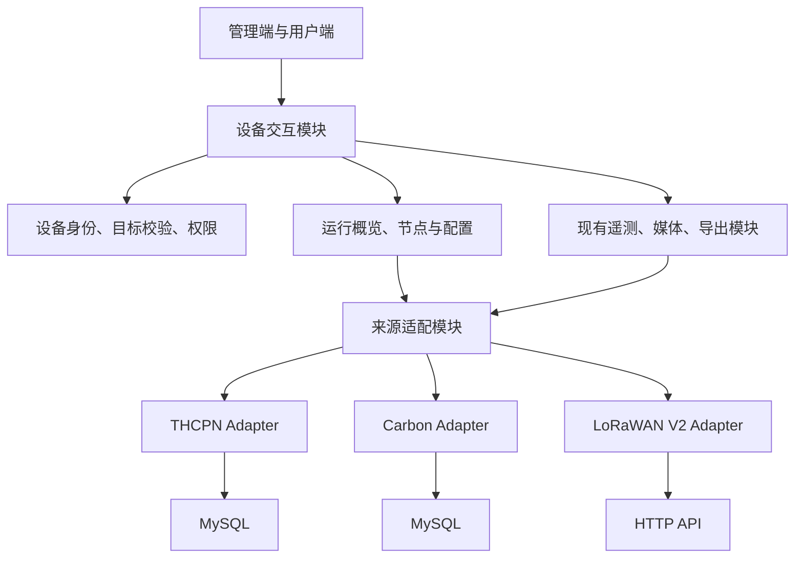

# 多来源设备统一交互重构设计

状态：核心流程已实施，真实上游联调与浏览器验收尚未完成。日期：2026-09-14。

本次落地：统一来源映射及来源字段、显式节点 target、两类组网站共享概览与查询、按节点导出、标准站与碳汇共用时间工具栏、LoRaWAN 分页完整性与配置驱动的指标发现、批量查询的部分失败、数据库连接复用、THCPN 配置分阶段结果与恢复、LoRaWAN 面向设备的配置入口及恢复、后台全量同步与操作记录。

运行要求：API 和 worker 使用同一版本，先应用迁移 32、33；后台全量同步需要 Redis 和 worker。既有全量同步 URL 也返回 202 操作记录，调用者通过操作接口查询结果。设备 ID、数据流 ID 和归属保持不变，迁移遇到多个有效管理来源会停止并报告设备 ID。

本地验证：Go 全量测试、独立 PostgreSQL 中的映射迁移往返/冲突检查及同步任务记录测试、前端构建和新增的三条组网站交互测试通过。前端全量测试中，数据比较的 quality 断言和图片快捷导航断言在未修改的原文件上仍失败；Node 26 下测试需使用 `NODE_OPTIONS=--no-experimental-webstorage` 运行，避免其全局 localStorage 覆盖 jsdom。

尚未完成的验收与收口：真实 LoRaWAN 配置格式、稳定分页及源端应用确认需联调核实；四条主路径尚未做真实账号浏览器验收；日志界面及跨配置/日志的节点选中状态仍保留部分专用实现。本文件后续章节作为目标设计，不能将上述未验收内容视为已验证能力。

## 1. 目标与结论

保留三种来源的真实设备身份，统一用户理解设备、选择观测对象、查询数据、修改配置和查看操作结果的方式。此次可以调整数据结构、后端模块及前端页面，不以最小 diff 为目标。

核心决策：

1. `device_type` 描述设备角色，`source_family` 描述来源，`product_id` 只描述产品。停止使用产品标识推断来源和操作方式。
2. THCPN 节点是设备；LoRaWAN V2 节点是网关内的 node index。统一节点的交互投影，不统一它们的资产身份。
3. 将来源定位、状态校验、指标发现、读取与写入结果转换集中到来源适配模块。页面调用面向设备和操作对象的接口。
4. 统一页面骨架、查询控件和操作反馈，保留碳汇周期、媒体、源端高级配置等专用内容。
5. 数据完整性、部分失败、配置写入阶段必须成为明确契约，不能由不同页面自行猜测。

## 2. 已确认的业务模型

| 来源 | 平台设备 | 设备内部或关联对象 |
| --- | --- | --- |
| THCPN | 标准站、网关、节点均有独立设备记录，使用 type 区分 | 网关通过设备关系关联节点 |
| Carbon | 独立碳汇站 | 通量、周期查询中的 Node、地块等是站内业务对象，不建立组网站父子设备关系 |
| LoRaWAN V2 | 只有网关有设备记录 | 节点通过网关与 node index 定位，由 HTTP API 管理与读取 |

现有摄像头不属于本轮主要重构对象，但设备公共接口变化必须保持视频、媒体和相关权限可用。

### 类型、来源与产品

保留现有角色值 `standalone`、`gateway`、`gateway_node`、`carbon_sink`、`camera`。本轮没有必要仅为改名重写这些枚举。

LoRaWAN V2 是正式的来源分类，不新增与 `gateway` 并列的 `device_type=lorawan_v2`。其设备身份为 `device_type=gateway` 与 `source_family=lorawan_v2` 的组合。界面可以显示“LoRaWAN V2 组网站”，也可以按来源筛选。

列表和详情明确返回来源分类。前端不再根据 `product_id`、设备名称、数据流 code 前缀或是否查询成功推断来源。

### 节点定位与授权

节点列表使用明确的联合结构：

```ts
type NodeTarget =
  | { kind: "device"; device_id: string }
  | { kind: "gateway_node"; gateway_device_id: string; node_index: number };
```

节点条目包含名称、target、可用操作、最近数据时间及必要的业务摘要。共享节点列表和选中状态使用 target，不能只用 node index 作为跨站标识。

- THCPN target 中的 device_id 必须属于当前网关的有效节点关系。
- LoRaWAN target 必须匹配当前网关，且 index 存在于源端网关声明的节点范围。
- 不能通过任意传入设备 ID、index 或数据流 ID 越过设备可见性与工作区校验。
- THCPN 继续沿用当前基于网关关系的归属与可见性规则；节点有设备 ID 不代表本轮要赋予其独立分配能力。
- LoRaWAN 节点权限由网关与操作权限共同决定，不创建虚拟设备、认领凭证或独立归属。

节点即使没有近期数据，也必须能出现在合法的节点列表中。

## 3. 来源映射与数据归属

将两套设备来源映射整合为同一个模块及一张可容纳不同外部键的表。建议保留 `device_source_refs` 名称，以文本 `external_key` 接替只能表达整数的外部设备键；保留 `data_source_id`、`adapter_code`、状态及同步时间。

- THCPN、Carbon 的数字 ID 转为十进制文本，进入对应 Adapter 时校验并转换为整数。
- LoRaWAN 的外部键为网关 SN；node index 是网关内部地址，不写入独立设备映射。
- 保留来源和适配器命名空间，外部键唯一性不能跨数据源判断。
- `source_family` 以关联数据源为准，不在设备表维护另一份可独立修改的来源值。
- 设备管理来源与数据流读取来源是两个用途；统一管理映射不能移除现有数据流绑定或多源查询能力。

当前反向查询存在“取最近同步的一条”行为。迁移时必须检查同一设备是否存在多个有效管理映射：若存在，输出冲突清单并明确选择管理映射，不能依赖同步时间静默切换。最终每台受源系统管理的设备有一个明确管理来源；无来源的手工设备可以继续存在。

保留平台 device ID、data stream ID、serial_no、归属、父子关系、分享和导出引用。重构来源映射不重新创建设备。配置快照中的源配置 ID 按各来源原本语义保留，不能与网关 SN 混为一个 ID。

## 4. 后端模块设计



### 对外 Interface

围绕现有用户行为提供明确操作：读取设备上下文、列出节点、查询选定数据流、读取或修改某类配置、查询设备日志。沿用能满足该契约的现有路由，必要时替换；不先增加一个与现有逻辑并存的大型透传入口。

设备上下文包含角色、来源、操作对象、功能支持情况和当前调用者可执行的操作。普通用户不需要获取数据库名、DSN 引用、上游 API 地址或凭据；管理端按现有权限查看来源诊断信息。

Interface 隐藏来源选择、源端 ID 解析和节点地址转换。普通设备交互页面只提交平台设备 ID 或合法 target，不再先获取 source_id、gateway_sn 后拼接来源接口。

### 内部 Seam 与 Adapter

以实际共享的操作划分小 Interface，例如节点读取、遥测批量读取、配置读写、日志读取。三种 Adapter 实现各自支持的操作，不强迫 Carbon 实现图片读取，也不要求每个 Adapter 都实现所有控制功能。

底层连接管理、目标定位、数据源停用检查和错误转换在模块内统一处理。源端 SQL、JSON、HTTP 参数留在各 Adapter 内。

复用现有 telemetry/media/export 模块，不再建设第二套查询或任务引擎。现有 `datasource.Service` 中与来源相关的同步、配置、运行信息逻辑逐项迁出；替换一个调用链后删除对应重复实现。

### 功能支持与权限

现有 `device.capabilities` 可以由管理员维护，不应直接作为来源接口确实可用的证据。需区分：

- 来源及设备配置是否支持此功能。
- 当前用户是否有权限执行。
- 设备或数据源当前状态是否允许执行。

上下文返回当前功能的支持状态和操作权限；服务端在每次执行时再次校验。暂时源端不可达不等于“不支持”，页面保留入口并显示可重试错误。此轮只定义实际已有功能，不建设任意插件或动态表单引擎。

### 数据查询契约

- `complete` 表示请求时间范围内该序列的读取是否完整；页内截断不能标为完整。
- `sampled` 表示完整时间范围的数据经过降采样，不用于掩盖局部截断。返回数量、扫描数量、有效值数量分别命名，避免混用 `source_count`。
- `Adaptive` 和目标点数必须实际生效；无法满足时明确表达限制，不能无声忽略。
- 单个序列或节点失败返回具体失败项，成功项保留；整个来源不可用时明确呈现整体错误。
- UI 不把截断序列称为“全部数据”；导出不把点数不足上限当成读取完整，必须检查适配器的完整性及分页结果。
- 分页和导出保证确定的顺序，处理相同时间戳；LoRaWAN 上游的排序、稳定分页能力需在实施时通过接口契约或测试验证，不能仅靠最后排序保证不漏数据。

### 指标发现与同步

以源端有效配置和节点清单为指标发现依据。历史数据只用于补充或核验，不用“近三天第一条数据”定义设备具有哪些指标。源配置无法识别时返回可诊断错误或部分结果，不伪报完整成功。

数据流绑定显式保存 target 与源指标标识，前端不解析 `lora_node_...` 得出节点。既有数据流 ID 保持不变；新发现指标的代码生成需要确定性和冲突检测。

同步区分配置明确删除、没有上报、读取失败。仅在权威配置完整读取且确认移除后停用对应指标，保留历史引用。同步结果返回成功项、失败项、停用项及原因。

外部读取在开启平台事务前完成；事务只负责应用已读取并验证的快照。并发同步同一设备时采用互斥或版本校验，不能让较旧快照覆盖较新配置。同一外部设备的重复同步不能产生重复平台设备。

### 配置写入与状态

不同来源可以使用不同配置表单，但共享“读取当前值—编辑—校验—提交—展示结果”流程。保留已有乐观版本校验；源端不支持版本条件时，不宣称具备相同并发保证。

写入结果分别描述源端是否接受、平台是否同步、设备是否确认应用。源端不能确认应用时显示未知，不制造“等待应用”或“已生效”状态。

THCPN 跨库写入需要可恢复的操作记录：先登记操作，再写源端，随后更新平台快照。源端成功但平台同步失败时，提供只重新读取和应用平台快照的恢复操作，不能再次盲目写入源配置。遇到响应丢失等结果不确定情况标记未知并核对源端，不直接重复执行控制写入。

连接按数据源复用，并有明确关闭、超时及凭据变更失效机制。大批量同步复用已有异步任务基础能力，进度与部分失败可查询；不在一次浏览器请求和一个数据库事务中串行等待整个来源。

## 5. 前端交互设计

### 设备列表与详情

统一设备卡片的信息位置：名称、类型、来源标识、平台状态、最近数据时间、位置和进入详情。LoRaWAN 节点数来自节点模型，不再显示“节点按数据流管理”这类实现解释。

详情保留同一导航顺序：概览、数据、配置、日志、资料、分享、记录。仅展示设备支持且当前用户可访问的入口；日志与平台操作记录明确区分。摄像头保留视频专用入口。管理端和用户端复用行为及数据模型，不强迫两个应用采用完全相同的视觉组件。

概览使用共享布局和业务内容槽：标准站显示指标，组网站显示节点与摘要，碳汇显示通量与周期摘要。区分平台启用状态、生命周期状态、通信状态和数据新鲜度；未知通信状态显示未知或最近上报时间。

### 组网站节点与数据

THCPN、LoRaWAN 共用“节点列表—选节点—选指标—查看数据”的操作结构。节点选择跨概览、数据、配置与日志保持一致；切换设备时清理不属于新设备的节点、指标和待提交编辑状态。

THCPN 节点可进入其独立设备资料；LoRaWAN 节点显示站内详情。节点列表可以为空，但必须区分确实没有节点与节点清单读取失败。

查询工具栏共用时间范围、快捷时间、指标选择、刷新、曲线/表格切换及导出入口。概览通过现有批量查询能力读取同节点的多指标，不为每条指标发起独立上游扫描。

Carbon 共享时间、刷新、反馈和导出操作位置，内容区保留通量与周期、Node × 地块等专用选择，不伪装成 THCPN 子设备树。

### 配置、日志与反馈

可共同表达的采样时间操作复用现有 sampling profile 逻辑，并检查每种来源能够无损表达的字段。无法等价转换的源配置保留专用编辑器，不把所有设备强制塞入同一个 JSON 表单。

日志共享筛选、分页、详情和下载动作；日志内容保留专用展示。取消、切换目标、保存成功后的刷新和未保存编辑提示采用一致规则。

错误展示区分无数据、来源不可用、无权限、部分失败、配置冲突和结果不确定；成功的节点数据不因另一个节点失败而整页消失。

### 与现有导出设计的关系

沿用 `adr/0001-unified-device-export-lifecycle.md`：统一导出任务、状态、ZIP 交付和下载入口，保留标准站批量清单、组网站节点树、碳汇矩阵的目标选择。查询时间沿用当前文档规定的默认七天，不通过额外查询最新数据悄悄改变窗口。

统一工具栏中的导出入口深链到相应创建界面并预填设备、节点和时间；不另造详情页同步导出链路。

## 6. 实施顺序与验收

| 阶段 | 主要变化 | 必须验证 |
| --- | --- | --- |
| 1. 身份与来源 | 统一映射、来源上下文、节点 target；更新 OpenAPI 和生成类型 | 原 ID 与引用不变；无重复设备；冲突映射不被静默覆盖；节点越权请求被拒绝 |
| 2. 组网站闭环 | 两类网关共用节点导航、指标查询和批量读取；修复完整性与发现问题 | 无近期数据也能选节点；节点指标不串站；30 条取 10 条显示截断；稀疏指标导出不误报完整 |
| 3. 全设备页面 | 标准站与 Carbon 采用共享骨架、工具栏、状态和反馈 | 碳汇周期与地块选择完整；分享、记录、视频及现有导出保持可用 |
| 4. 配置与同步 | 配置操作结果、恢复记录、同步收敛、连接管理及长任务 | 源写成功/平台失败可恢复；不确定写入不盲重试；停用来源所有入口生效；并发同步不回退配置 |
| 5. 收口 | 切换剩余调用者，删除旧来源分支与废弃接口 | 公共页面不再使用 product_id 或数据流前缀识别来源；无两套并行业务链路 |

每个阶段包括必要的接口、数据库、调用方和验证，形成可运行的纵向功能。查询正确性问题随首次接入对应链路一起修复，不等所有页面重构后再处理。

第一阶段涉及 `internal/device`、`internal/datasource`、SQL 查询及迁移、`docs/openapi.yaml` 和 `app/packages/api`。第二、三阶段涉及管理端、用户端设备详情及查询模块。第四阶段再拆分来源实现和配置写入流程。现有未提交的 LoRaWAN 配置、日志功能纳入迁移，不覆盖或丢弃。

### 数据迁移与接口切换

开发阶段可进行接口断代，仓库内前后端在同一发布版本切换。已有公开接口是否有仓库外调用者须在实施前盘点；不能因仍在测试阶段就假设无人使用。

迁移先导出并核验映射及引用，再转换两张映射表、配置读取和数据流 target。核验设备数量、节点关系、数据流绑定、归属、分享和导出引用后再删除旧结构。遇到冲突保留原数据并停止迁移，不通过清库或重新导入掩盖问题。

### 验证方式

- Adapter 契约测试：分页边界、同时间戳、缺值、指标冲突、无数据节点、源端错误与超时。
- 数据库集成测试：映射迁移、并发同步、删除指标、跨库部分失败与恢复、来源停用、节点归属与权限。
- 前端交互测试：跨页节点选择、设备切换、时间保留、配置未保存状态、部分失败、普通用户与管理员的入口差异。
- 运行相关 Go 测试及前端类型检查、构建和交互测试；对四条主路径做浏览器验收：标准站、THCPN 组网站、LoRaWAN 组网站、碳汇站。
- 按相同设备与指标集合比较上游扫描数和查询耗时；以证据确认批量读取及连接复用收益。

## 7. 设计依据与实施前需核实的事实

本设计基于当前工作区代码与用户确认的设备模型。前次评估中相关 Go 包测试通过，临时 overlay 测试复现 LoRaWAN 页内截断误标完整；未验证生产数据或真实上游服务。

可直接检查的实现位置：

- `internal/datasource/service.go`：来源分类、通用契约及现有 capabilities 相关入口。
- `internal/datasource/lorawan_v2.go`：独立映射、网关同步、单记录指标发现及分页。
- `internal/datasource/thcpn_sync.go`：独立节点同步、关系、配置跨库更新及缺失指标处理。
- `internal/datasource/carbon_runtime.go`：碳汇专用查询及来源连接。
- `internal/datasource/sampling_profile.go`：已有的共同配置语义。
- `internal/device/service.go`、`sql/queries/device.sql`：设备身份、资产来源和节点归属。
- `app/apps/platform/src/devices-page.tsx`：来源判断、节点数据与概览逐指标请求。
- `app/apps/admin/src/admin-devices.tsx`：来源判断与专用配置、日志入口。
- `internal/export/processor.go`：完整性判定及导出结果生成。

实施前重点核实：LoRaWAN 配置结构是否覆盖全部遥测指标、上游排序及分页保证、源端是否提供配置应用确认、当前是否存在多个有效管理映射、公开接口的外部调用者。缺乏证据时显式报告未知，不增加猜测性的能力或兼容路径。
